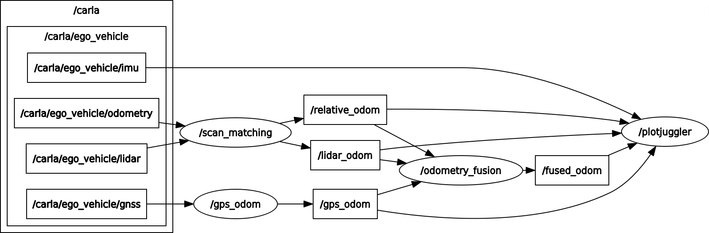

# Carla Multi Sensor Fusion

[](https://github.com/carla-simulator/ros-bridge)
[](http://carla.readthedocs.io)
[](https://github.com/carla-simulator/ros-bridge/blob/master/LICENSE)
[](https://github.com/carla-simulator/ros-bridge/releases/latest)

 This ROS package is a bridge that enables two-way communication between ROS and CARLA. The information from the CARLA server is translated to ROS topics. In the same way, the messages sent between nodes in ROS get translated to commands to be applied in CARLA.


## Features

- Provide Sensor Data (Lidar, Semantic lidar, Cameras (depth, segmentation, rgb, dvs), GNSS, Radar, IMU)
- Provide Object Data (Transforms (via [tf](http://wiki.ros.org/tf)), Traffic light status, Visualization markers, Collision, Lane invasion)
- Control AD Agents (Steer/Throttle/Brake)
- Control CARLA (Play/pause simulation, Set simulation parameters)

## Commands for Usecase 1

```bash
# start carla
cd /opt/Carla; ./Carla.sh

# start the ROS bridge with an example ego vehicle
ros2 launch carla_ros_bridge carla_ros_bridge_with_example_ego_vehicle.launch.py

# for scan matching point cloud odom
ros2 launch multi_sensor_fusion scan_matching.launch.py

# for gps to odom
ros2 launch multi_sensor_fusion gps_odom.launch.py

# for odom fusion
ros2 launch multi_sensor_fusion odom_fusion.launch.py

# for plot juggler
ros2 launch multi_sensor_fusion plot_juggler.launch.py
```
## Commands for Usecase 2

```bash

# start carla
cd /opt/Carla; ./Carla.sh

# start the ROS bridge with an example ego vehicle
ros2 launch carla_ros_bridge carla_ros_bridge_with_example_ego_vehicle.launch.py

# generate traffic
cd /opt/Carla/PythonAPI/examples; python generate_traffic.py -n 30


# for radar safety
ros2 launch multi_sensor_fusion radar_safety.launch.py
```

## ROS2 Graph



## Sensor Fusion EKF


### Available sensors for fusion

1. Lidar (point cloud data ) -> (x, y) (improvize)
2. GPS (lat long) -> (x, y) (low accuracy)
3. Odometry -> (x, y) (random noise)
4. Camera -> (x, y)
5. IMU -> (euler, yaw, pitch , roll)


## Sensor Fusion

1. Kalman Filter (ekf)


## Collison Track

1. If vehicle is coming from the infront then try to predict in how much seconds the collision is going to happen

## Predict position using sensor fusion

## Object Detection

```bash
conda activate ai

python tools/demo.py --source inference/images
```

## Commands for object detection and lane segmentation

```bash
/zenoh-bridge-ros2dds -l tcp/0.0.0.0:7447


conda activate ai

python opencv_publisher.py

ros2 run rqt_image_view rqt_image_view

python object_lane_detection_node.py
```

## Results

```bash
# with cpu

Done. (2.191s)
inf : (0.2139s/frame)   nms : (0.0011s/frame)

# with gpu
Done. (2.041s)
inf : (0.0525s/frame)   nms : (0.0606s/frame)


# video frames

# with gpu
Done. (44.252s)
inf : (0.0243s/frame)   nms : (0.0032s/frame)

# with cpu
Done. (84.558s)
inf : (0.1766s/frame)   nms : (0.0010s/frame)

```

# Major Changes

- Simulation implementation of the scenario of intersection where the vehicles will share their camera sensor data to the edge server
- Edge server will detect the objects and find the distance with radar, lidar or deep learning model e.g. maybe with [midas](https://pytorch.org/hub/intelisl_midas_v2/)
